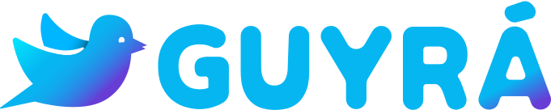

# Guyrá, the open source language learning platform!

## Introduction

Guyrá is a project that aims to gamefy language learning.

## Features:

- Flashcards
- Guided learning
- Dynamic exercises
- Dictionaries

## Supported Languages:

- English -> Spanish (10%)
- Portuguese -> English (85%)
- Spanish -> Portuguese (10%)
- English -> French (0%, PLANNED)

## Getting Started

See `BUILD.md`

## Contributing

Contributions are welcome! See `CONTRIBUTE.md`.

## License

This project is licensed under the GPLv3 License.